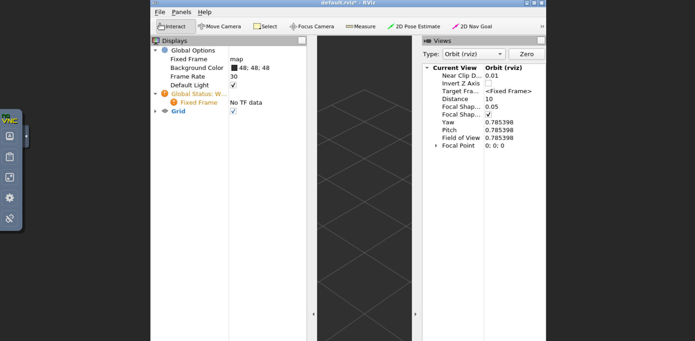

# docker-ros
## About
This project provides an easy way to get started with ROS noetic and is especially helpful for developing using the ROS Noetic environment. It allows the user to run the ROS noetic environment on Windows machines, which would otherwise require some additional effort. The container is based on docker-ubuntu-vnc-desktop, which allows access to the ROS installation through a VNC connection. The container can be used to quickly spin up and access a ROS environment, with all the relevant tools installed and configured. The container can also be used to quickly share ROS projects with other users, as the data and configuration is stored in the container. Furthermore, the container is configured to support the installation of integrated development environments (IDEs) in the shared workspace, which makes development easier and faster.

Based on image [docker-ubuntu-vnc-desktop](https://github.com/fcwu/docker-ubuntu-vnc-desktop).

Provides access to a clean **ROS noetic** (desktop full) installation. As it was intended for using ROS under Windows:

<b>Works and tested on Windows.</b>

## Container
The following code is already added to source ROS noetic in ~/.bashrc and in ~/.profile:

`echo "source /opt/ros/noetic/setup.bash" >> ~/.bashrc
source ~/.bashrc`

## Build Container
Inside folder `container/` run

`docker build .` 

## Run Container
This command will run a Docker container with the name "dockerros" and will map the port 6080 to port 80 on the host machine. It will also mount the c:/ws directory from the host machine to the /home/ubuntu/catkin_ws directory in the container, and the container will be run in detached mode. Additionally, the shared memory size of the container will be limited to 512MB.

`docker run -p 6080:80 --name dockerros -v c:/ws:/home/ubuntu/catkin_ws -d dockerros --shm-size=512m`

-p 6080:80: Maps port 6080 on the host machine to port 80 on the container

* --name dockerros: Names the container "dockerros"
* -v c:/ws:/home/ubuntu/catkin_ws: Mounts the c:/ws directory from the host machine to the /home/ubuntu/catkin_ws directory in the container (optional, but recommended when developing on host)
* -d dockerros: Runs the container in detached mode
* --shm-size=512m: Limits the shared memory size of the container to 512MB

> **The mounted folder might be empty:** By default there would lie an empty /src folder inside but this will be overridden when using the mount command. Hence, anything that is inside the host folder will be mounted to the container.

## Developing using this container

### Prerequisites
* Docker container installed and running
* Source files stored in a mounted directory (e.g. c:/ws)

### Steps
1. Set the mounted host directory (here: c:/ws) to the directory where your source is (e.g. working space, project directory, git).
2. Run `docker exec -it dockerros /bin/bash` to connect to the Docker container.
3. Run `catkin init` to initialize the workspace.
4. Develop as usual. You can use ROS commands and have multiple Bash shells open.

In order to open GUI like rviz access the noVNC interface (default: localhost:6080) 
through the browser:

Enjoy!
